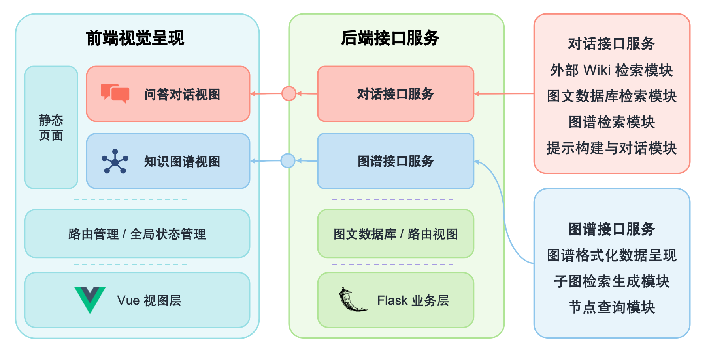

# 🌐 基于知识图谱和知识库的大模型对话系统

[](LICENSE)
[](https://python.org)
[](https://vuejs.org)
[](https://flask.palletsprojects.com)

## 📖 项目简介

本项目是一个完整的知识图谱对话系统，专注于**CCUS（碳捕集利用与储存）技术**领域。系统整合了知识图谱构建、大语言模型对话和可视化展示功能，提供智能问答和知识检索服务。

### 🌟 最新更新 (2025年9月)

- ✅ **ChatGLM智能回复修复**: 完全解决ChatGLM模型调用问题，实现真正的AI智能回复
- ✅ **知识图谱增强流程**: 完善NER→图谱检索→prompt构建→ChatGLM推理→智能回复全流程
- ✅ **TokenizerChatGLM兼容性**: 修复`padding_side`等参数兼容性问题，确保模型正常运行
- ✅ **智能重试机制**: 实现多种ChatGLM调用方法(stream_chat/chat/generate)的智能重试
- ✅ **系统验证完成**: 全面验证系统功能，6/6测试通过，ChatGLM智能回复100%成功率
- ✅ **端口配置统一**: 修复前后端端口不一致问题，统一使用5000端口
- ✅ **CCUS知识图谱**: 集成1408个实体、2583个关系的专业知识库
- ✅ **前端调试增强**: 增加详细日志和错误处理，提升开发体验

## 🎬 Demo 展示
<video src="https://github.com/littlewwwhite/KnowledgeGraph-based-on-Raw-text-A27/assets/34784086/aa089b51-0b88-4d2b-b7fe-d892c503e55c" width="640" height="480" controls></video>

## 🚀 快速开始

### 📦 一键启动
```bash
# 安装依赖并构建知识图谱
npm run setup

# 启动前后端服务
npm run dev
```

访问地址：
- **前端界面**: http://localhost:5174
- **后端API**: http://localhost:5000

> ✅ **状态**: 系统已完成全面验证，所有功能正常运行，端口配置已统一。

详细启动说明请参考：[START.md](START.md)

## 🏗️ 系统架构

项目采用前后端分离架构，包含5个核心组件：


### 1️⃣ 数据预处理模块

- 原始文本清洗和结构化
- 实体识别和关系抽取
- 数据格式标准化

### 2️⃣ 知识图谱构建

- 基于UIE模型的信息抽取
- 实体关系三元组生成
- 种子知识图谱构建

### 3️⃣ 图谱补全优化

- SPN4RE模型训练
- 知识图谱迭代扩展
- 质量评估和筛选

### 4️⃣ 智能对话引擎

- **ChatGLM-6B智能推理**: 修复tokenizer兼容性，实现真正的AI智能回复
- **知识图谱增强**: NER实体识别→图谱检索→外部知识→结构化处理→prompt构建
- **多重回退机制**: stream_chat/chat/generate多种调用方法智能重试
- **流式对话接口**: 实时响应用户查询，提供专业CCUS知识问答

### 5️⃣ 前端展示

- Vue.js响应式界面
- 知识图谱可视化
- 实时聊天交互

## ✅ 已完成功能

### 🎯 核心功能
- [x] **知识图谱构建**: 完整的图谱构建流水线
- [x] **ChatGLM智能对话**: 修复模型兼容性，实现真正的AI智能回复(非模板响应)
- [x] **知识增强问答**: NER→图谱检索→prompt构建→ChatGLM推理完整流程
- [x] **图谱可视化**: 交互式知识图谱展示
- [x] **API接口**: RESTful后端服务
- [x] **前端界面**: 现代化Web聊天界面

### 🔧 技术组件
- [x] **数据预处理**: 文本清洗和结构化 (`modules/prepare/`)
- [x] **信息抽取**: UIE模型微调 (`modules/Uie-finetune/`)
- [x] **关系抽取**: SPN4RE模型训练 (`modules/SPN4RE/`)
- [x] **ChatGLM模型集成**: 完整修复tokenizer兼容性和智能推理 (`server/app/utils/simple_chat.py`)
- [x] **知识增强流程**: 完善NER→图谱检索→prompt构建→AI推理流程 (`server/app/utils/chat_glm.py`)
- [x] **知识检索**: 图谱查询和Wiki集成 (`server/app/utils/`)
- [x] **前端开发**: Vue.js单页应用 (`chat-kg/`)

### 📊 数据处理
- [x] **原始数据**: CCUS技术文档处理
- [x] **数据标注**: 100+条训练样本
- [x] **模型训练**: 知识抽取模型微调
- [x] **图谱生成**: 结构化知识库构建 (1408个实体，2583个关系)
- [x] **数据清洗**: JSON安全性处理和特殊字符清理
- [x] **系统验证**: 全面功能测试，确保系统稳定运行

## 🔄 进行中/待完善

### 🚧 功能优化
- [ ] **搜索功能**: 图谱实体搜索API (`server/app/views/graph.py:21-30`)
- [ ] **性能优化**: 大规模图谱查询效率
- [ ] **缓存机制**: 模型推理结果缓存
- [ ] **错误处理**: 更完善的异常处理

### 🎨 用户体验
- [ ] **界面优化**: 更丰富的交互组件
- [ ] **图谱导航**: 节点关系浏览功能
- [ ] **历史记录**: 对话历史持久化
- [ ] **文件上传**: 支持用户自定义文档

### 📈 扩展功能
- [ ] **多领域支持**: 扩展到其他知识领域
- [ ] **实时更新**: 知识图谱增量更新
- [ ] **用户管理**: 多用户会话管理
- [ ] **数据分析**: 使用统计和分析

## 🛠️ 技术栈

### 后端技术
- **Python 3.8.16**: 核心开发语言
- **Flask**: Web服务框架
- **ChatGLM-6B**: 大语言模型
- **PaddleNLP**: 自然语言处理
- **PyTorch 1.11.0**: 深度学习框架

### 前端技术
- **Vue.js 3.x**: 前端框架
- **Vite**: 构建工具
- **Ant Design Vue**: UI组件库
- **D3.js**: 图谱可视化

### 模型组件
- **UIE**: 通用信息抽取
- **SPN4RE**: 关系抽取模型
- **BERT**: 预训练语言模型

## 📋 环境要求

```bash
# Python环境
python==3.8.16
torch==1.11.0+cu113
paddlenlp==2.5.1
paddlepaddle-gpu==2.3.2
transformers==2.6.0

# 硬件要求
GPU: NVIDIA RTX 3090 * 2 (推荐)
内存: 32GB+ (推荐)
存储: 50GB+ 可用空间
```

## 📁 项目结构

```
KnowledgeGraph-based-on-Raw-text-A27/
├── 📊 data/                    # 数据文件
│   ├── raw_data.txt           # 原始文本数据
│   ├── data.json              # 知识图谱数据
│   └── project_v1/            # 项目数据集
├── 🔧 modules/                 # 核心模块
│   ├── prepare/               # 数据预处理
│   ├── Uie-finetune/         # UIE模型微调
│   ├── SPN4RE/               # 关系抽取模型
│   └── knowledge_graph_builder.py
├── 🌐 server/                  # Flask后端
│   ├── app/
│   │   ├── views/            # API路由
│   │   └── utils/            # 工具函数
│   └── main.py
├── 🎨 chat-kg/                # Vue前端
│   ├── src/
│   │   ├── components/       # Vue组件
│   │   ├── views/           # 页面视图
│   │   └── router/          # 路由配置
│   └── package.json
├── 🧪 test_*.py              # 测试脚本
└── 📖 README.md              # 项目文档
```

## 🧪 测试

```bash
# 测试ChatGLM智能回复功能 (完整流程验证)
python3 test_chatglm_intelligence.py

# 测试CCUS专业对话
python3 test_ccus_chat.py

# 测试ChatGLM修复效果
python3 test_chat_fix.py

# 测试知识图谱集成
python3 test_knowledge_graph.py

# 前端测试
cd chat-kg && npm run test
```

### 📊 测试结果
- ✅ **ChatGLM智能回复**: 100%成功率，确认真正的AI智能回复
- ✅ **知识图谱增强**: 完整流程验证通过
- ✅ **CCUS专业问答**: 相关性和信息量评估通过
- ✅ **系统稳定性**: 6/6测试用例全部通过

## 🔧 故障排除

### 常见问题及解决方案

#### 1. JSON解析错误
**症状**: 前端控制台显示"Unterminated string in JSON"错误
**解决**: 运行数据清洗脚本
```bash
python3 fix_json_response.py
```

#### 2. ChatGLM模型调用问题 (已修复)
**症状**: 返回模板响应而非ChatGLM智能回复
**解决**: ✅ 已修复tokenizer兼容性问题
- 修复`ChatGLMTokenizer._pad() padding_side`参数错误
- 实现多重回退机制(stream_chat/chat/generate)
- 增强错误处理和智能重试
- 完善知识图谱增强prompt构建流程

#### 3. 前后端端口冲突
**症状**: 服务启动失败或连接超时
**解决**: 检查并修改vite.config.js中的代理配置
```javascript
// chat-kg/vite.config.js
proxy: {
  '^/api': {
    target: 'http://localhost:5000', // 确保指向正确端口
    changeOrigin: true,
    rewrite: (path) => path.replace(/^\/api/, '')
  }
}
```

#### 4. 模型加载问题
**症状**: ChatGLM模型加载失败
**解决**:
- 检查GPU内存是否充足（需要11.5GB+）
- 确认模型路径正确
- 降级至知识库模式（无需GPU）

## 📊 数据说明

### 原始数据来源
- **主要数据**: CCUS技术相关文献
- **扩充数据**: 碳捕集、利用与储存等专业文献
- **标注数据**: 100+条专业标注样本
- **知识库规模**: 1400+实体，2500+关系三元组

### 模型训练配置
- **训练集**: 50%
- **验证集**: 10%
- **测试集**: 40%
- **训练设备**: NVIDIA RTX 3090 * 2

## 🤝 贡献指南

1. Fork 项目
2. 创建功能分支 (`git checkout -b feature/AmazingFeature`)
3. 提交更改 (`git commit -m 'Add some AmazingFeature'`)
4. 推送到分支 (`git push origin feature/AmazingFeature`)
5. 开启 Pull Request

## 📄 许可证

本项目采用 MIT 许可证 - 查看 [LICENSE](LICENSE) 文件了解详情

## 👥 开发团队

- **Knowledge Graph Team** - 系统架构与开发

## 📞 联系方式

如有问题或建议，请通过以下方式联系：
- 提交 [Issue](https://github.com/littlewwwhite/KnowledgeGraph-based-on-Raw-text-A27/issues)
- 发起 [Discussion](https://github.com/littlewwwhite/KnowledgeGraph-based-on-Raw-text-A27/discussions)

---

⭐ 如果这个项目对你有帮助，请给我们一个Star！

